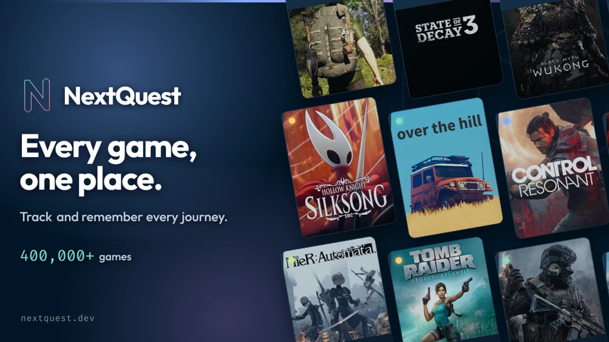
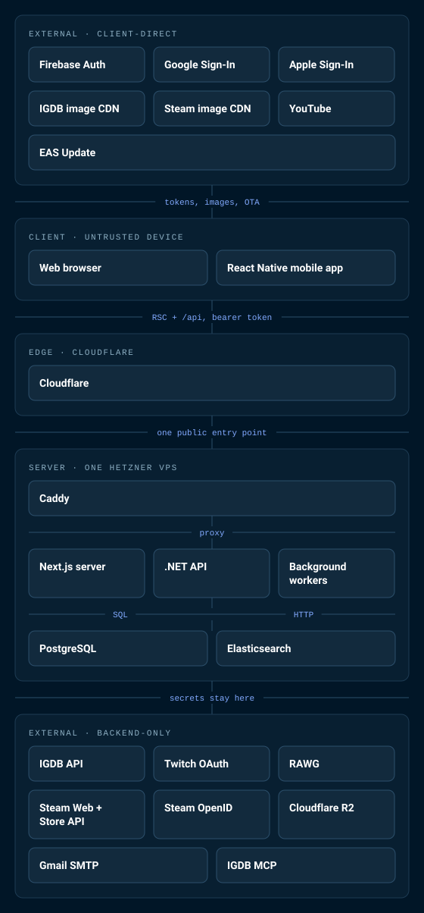

# NextQuest

  

  
  
  
  

> [!NOTE]
> **This repository is a public stack overview, not the source.**
> The application lives in a private monorepo. Email
> **[support@nextquest.dev](mailto:support@nextquest.dev)** if you want to talk about it.

NextQuest tracks what you're playing across web, iOS and Android. A game can sit in *playing* on
Switch and *finished* on PC at the same time, because most trackers model one row per title and
that breaks the first time you reinstall something you beat in 2019, so this one models
playthroughs and keeps one per platform. Works offline. The catalog reseeds every night from IGDB.

## System architecture

The grouping is by trust boundary. What matters is which code runs on a machine someone else
controls.

<table>
<tr>
<td width="56%" valign="top">

</td>
<td valign="top">

**External · client-direct**

- **Firebase Auth** · issues the ID token, email sign-in
- **Google Sign-In** · native SDK on the phone
- **Apple Sign-In** · native SDK on the phone
- **IGDB image CDN** · cover art
- **Steam image CDN** · capsule and icon art
- **YouTube** · trailer playback
- **EAS Update** · over-the-air JS bundles

**Client · untrusted device**

- **Web browser** · Next.js, React, server-rendered
- **React Native mobile app** · Expo, iOS and Android, on-device SQLite, OS keychain

**Edge · Cloudflare**

- **Cloudflare** · DNS, proxy, Full Strict TLS

**Server · one Hetzner VPS**

- **Caddy** · the only public ports
- **Next.js server** · RSC and route handlers
- **.NET API** · ASP.NET Core minimal APIs
- **Background workers** · nightly seed, Steam and RAWG refresh
- **PostgreSQL** · one database, user and catalog schemas
- **Elasticsearch** · search indices and rolling telemetry

**External · backend-only**

- **IGDB API** · nightly CSV catalog dumps
- **Twitch OAuth** · IGDB client credentials
- **RAWG** · metadata backfill, off the request path
- **Steam Web + Store API** · ownership, playtime, app details
- **Steam OpenID** · account linking
- **Cloudflare R2** · nightly backup
- **Gmail SMTP** · signup and seeding reports
- **IGDB MCP** · semantic search, from the Next.js server

</td>
</tr>
</table>

<b>What you can do with it</b>, for anyone who would rather read about the product

 

**Build a real library**
- Track games across five statuses: *playing*, *queued*, *backlog*, *finished*, and *dropped*
- Keep separate playthroughs per platform
- Capture ratings, reviews, and structured notes that follow you between phone and desktop
- Curate lists and tier lists you can share
- Favourites, collections, and filtering by genre, theme, platform, year, and franchise

**Discover what's next**
- Search and browse a deep catalog with fast, relevance-ranked results
- Companion data from store platforms, including store presence and player activity
- Franchise and company pages with sortable releases
- Daily challenges and quizzes built from your own library

**Have a little fun**
- Mini-games tucked inside the web app, including a retro arcade cabinet
- Shareable scores and leaderboards

**Built for the way you actually use it**
- Works offline; everything syncs back the moment you reconnect
- Drag, swipe, and haptics for prioritising what is next
- Deep links open straight to the right game or list on whichever device you are on
- Custom avatars, no profile photo required

**Your account, your data**
- Sign in with Google, Apple, or email
- One-click data export, so you can leave with a complete copy of everything you created
- Your real name is never published; public pages use your username only

**A look of its own**
- Custom Night Owl OLED dark theme
- Hand-picked typography and a coherent visual language across every surface

## Where to find it

| Surface | Where |
|---|---|
| Web app | **[nextquest.dev](https://nextquest.dev)** |
| iOS | **[App Store](https://apps.apple.com/app/id6751153491)** |
| Android | **[Google Play](https://play.google.com/store/apps/details?id=com.dangervalentine.nextquest)** |
| Support | [support@nextquest.dev](mailto:support@nextquest.dev) |

## License

**All Rights Reserved.** This project and its source code are proprietary and confidential. No
part of this software may be reproduced, distributed, or transmitted in any form without prior
written permission of the author.

Game media belongs to the respective publishers and appears here for illustration.
